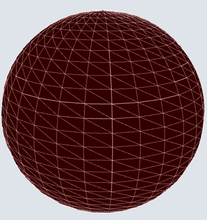
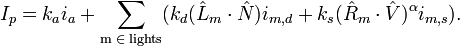

## Advanced Computer Graphics and Vision

The scene draws a sphere planet, which is generated from several buffers. These buffers are populated in the `setUpGlobeBuffers` function, from two loops. The first loop populates the normal and position buffers, by looping through a number of sections vertically and horizontally and calculating the position and orientation of vertices in triangles. The vertex data as a point in the scene space. The number of vertical and horizontal sections is defined by the `n` and `m` variables in the `setUpGlobeBuffers` function, the radius of the sphere is defined by the variable `r`.



In addition to the normal and position buffers, the texture buffer data is generated in the first loop. This maps each vertex onto a point in the texture image so that it can be sampled in the shader.

The second loop generates the index data for the buffer, which is used to retrieve vertices from the other buffers in the correct order. 

The buffers are internally stored in the `globe` object, part of the program global object `pwgl`. They are used later in the program in the `drawGlobe` function. Each buffer is bound then used to draw the elements onto the canvas.

```javascript
gl.drawElements(gl.TRIANGLES, pwgl.globe.VERTEX_INDEX_BUFF_NUM_ITEMS, gl.UNSIGNED_SHORT, 0);
```

This will draw a static sphere, however the specification requires the planet to be orbiting slowly on it's vertical axis. This is achieved in the `draw` function, applying a small rotation transformation to the sphere model-view matrix for each animation frame. This achieves the optical illusion of a slow orbit.

```javascript
mat4.rotateY(pwgl.modelViewMatrix, -pwgl.globe.angle, pwgl.modelViewMatrix);
```

The application must also draw a satellite as a 2x2x2 cube. This also achieved using 4 buffers that are initialised in the `setUpSatelliteBuffers` function. Instead of using a loop, each value in the buffers is created manually. To create a 2x2x2 cube, the position buffer holds positions that are 2 values away from the origin: i.e. at `2.0` or `-2.0`.

The cube buffers are stored in the `satellite` object, again part of the global object `pwgl`, and used in the `drawSatellite` function to draw the cube. 

```javascript
gl.drawElements(gl.TRIANGLES, pwgl.satellite.VERTEX_INDEX_BUFF_NUM_ITEMS, gl.UNSIGNED_SHORT, 0);
```

This will draw the cube at origin, within the existing globe. The application needs to move the model out and move according to it's orbit. This is done in the `draw` function. The application works out the updated position of the satellite since the previous animation frame and applies a transformation to move the model-view matrix to this position. The application must also scale the cube down to the appropriate size in comparison to the globe, and this is done by application a scale transformation to the cube. Finally for one side of the cube to remain facing the planet at all times, the cube must be rotated for each animation frame. This is achieved by applying a rotation transformation around the Y-axis, rotating the cube in the opposite direction to the orbit.

```javascript
// Translates satellite into orbit
mat4.translate(pwgl.modelViewMatrix, [pwgl.satellite.x, pwgl.satellite.y, pwgl.satellite.z], pwgl.modelViewMatrix);
// Scales satellite to correct size
mat4.scale(pwgl.modelViewMatrix, [0.2, 0.2, 0.2], pwgl.modelViewMatrix);
// Rotates to face earth
mat4.rotateY(pwgl.modelViewMatrix, -pwgl.satellite.angle, pwgl.modelViewMatrix);
```

Both the planet and the satellite are textured. As discussed, the texture mapping data is stored in the texture buffers when the buffers are created. The textures themselves are initialised in the `setUpTextures`, `loadImageForTexture` and `textureFinishedLoading` functions. For each texture, an image element is created and loaded with the image URL. A callback is created to be called when the image has finished loading into the element. The callback binds the image element to the texture and generates mipmap textures.

The specification document states that the satellite cube has two different parts for the texture. One side of the cube must be grey and all other sides must be gold or yellow. This is achieved by creating a single texture of two squares, one grey and one gold.


The texture is then mapped according to which side is a certain colour. In the satellite's texture buffer 5 of the sides are mapped to `0.5` to `1.0`, thereby mapping them to the golden colour in the texture. The remaining side, the left side, is mapped to `0.0` to `0.5`, thereby mapping to the grey colour in the texture.

The scene is lit from above using a directional light. The application uses the Phong lighting model, where ambient, diffuse and specular light are all calculated to simulate natural light.



The vertex shader calculates the position and normal to eye coordinates which are them passed to the fragment shader. 

```
vPositionEye = vertexPositionEye4.xyz / vertexPositionEye4.w;
vNormalEye = normalize(uNMatrix * aVertexNormal);
```

In the Phong model, most of the calculation is done in the fragment shader. This is because each fragment must calculate it's diffuse and specular light colours. 

In the fragment shader, diffuse light is calculated first. The vector to the light source (L) is found. This is then used to calculate the diffuse light weighting. Later in the shader this is multiplied by the diffuse light colour, provided by the application.

```
vec3 vectorToLightSource = normalize(uLightPosition - vPositionEye);
float diffuseLightWeighting = max(dot(vNormalEye, vectorToLightSource), 0.0);
```

Next, specular light is calculated. Again, the vector to light source is used, this time to calculate the reflection vector, the vector at which the light is reflected. Next the vector to the eye is calculated. Using these, the dot product is calculated, and raised to the power of the shininess constant. This gives the specular light weighting. Later in the shader, this is multiplied by the specular light colour, provided by the application.

```
vec3 reflectionVector = normalize(reflect(-vectorToLightSource, vNormalEye));

vec3 viewVectorEye = -normalize(vPositionEye);

float rdotv = max(dot(reflectionVector, viewVectorEye), 0.0);
float specularLightWeighting = pow(rdotv, shininess);
```

All of the light components (ambient, diffuse and specular) are then summed to produce the overall light weighting.

```javascript
vec3 lightWeighting = uAmbientLightColor + uDiffuseLightColor * diffuseLightWeighting + uSpecularLightColor * specularLightWeighting;
```

Finally, the colour from the texture sampler is multiplied by the light colour, to get the final light colour for the fragment.

```
gl_FragColor = vec4(lightWeighting.rgb * texelColor.rgb, texelColor.a);
```

The last part of the specification describes how the scene must be interactive. The scene can be rotated by clicking and dragging using the mouse. This is achieved by capturing the mouse movement while the mouse is down. This is then used to calculate the direction and distance travelled while the mouse is down.

```javascript
function handleMouseDown(e) {
	mousedown = true;
	lastMouseX = e.clientX;
	lastMouseY = e.clientY;
}

function handleMouseUp(e) {
	mousedown = false;
}

function handleMouseMove(e) {
	// If mouse wasn't down, exit
	if ( ! mousedown)
		return;

	xRotation = -lastMouseY + e.clientY;
	yRotation = -lastMouseX + e.clientX;

	lastMouseX = e.clientX;
	lastMouseY = e.clientY;
}
```

Then, during the animation loop, the model-view matrix is rotated in the appropriate directions.

```javascript
mat4.rotateX(pwgl.modelViewMatrix, xRotation / 100, pwgl.modelViewMatrix);
mat4.rotateY(pwgl.modelViewMatrix, yRotation / 100, pwgl.modelViewMatrix);
```

The specification also describes how the scene can be zoomed in or out, or moved. This is achieved using the mouse scroll. The application listens to mouse scroll events and captures the distance scrolled.

```javascript
if (e.wheelDelta) {
	if (e.shiftKey)
		transX -= e.wheelDelta / 120;
	else if (e.altKey)
		transY += e.wheelDelta / 120;
	else
		transZ += 1 / 120 * e.wheelDelta;
}
else {
	if (e.shiftKey)
		transX += e.deltaY / 10;
	else if (e.altKey)
		transY += e.deltaY / 10;
	else
		transZ += -e.deltaY / 10;
}
```

Again, during the animation loop, the projection matrix is transformed so that the camera moves relative to the origin. Movement along the Z-axis zooms the camera in or out. Movement along the X-axis or Y-axis moves the camera left and right or up and down respectively.

```javascript
mat4.translate(pwgl.projectionMatrix, [transX, transY, transZ], pwgl.projectionMatrix);
```

Finally, the last interaction is the ability to control the orbit of the satellite using the keyboard. By pressing the up or down arrows, the diameter of the orbit is increased or decreased. Keyboard events are listened to and cached by the application.

```javascript
function handleKeyDown(e) {
	if (e.keyCode == 28 || e.keyCode == 40)
		e.preventDefault();

	pwgl.interaction.listOfPressedKeys[e.keyCode] = true;
}

function handleKeyUp(e) {
	if (e.keyCode == 38 || e.keyCode == 40)
		e.preventDefault();

	pwgl.interaction.listOfPressedKeys[e.keyCode] = false;
}
```

Then, during the animation loop this cache is checked to see whether these keys have been pressed. The radius of the satellite model is then increased or decreased.

```javascript
function checkPressedDownKeys() {
	// Up arrow, increase radius of orbit
	if (pwgl.interaction.listOfPressedKeys[38]) {
		pwgl.satellite.circleRadius += 0.1;
	}

	// Down arrow, decrease radius of orbit
	if (pwgl.interaction.listOfPressedKeys[40]) {
		if (pwgl.satellite.circleRadius < 5.5)
			return;

		pwgl.satellite.circleRadius -= 0.1;
	}
}
```